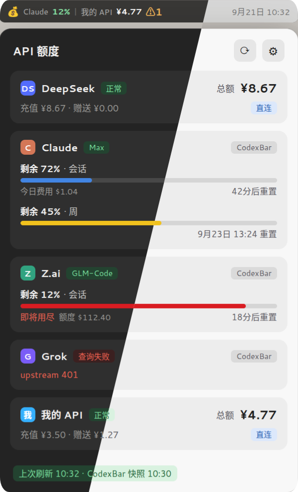

# API Balance

中文 · [English](README.en.md)

**API Balance** 是一个 GNOME Shell 扩展，用于在桌面顶栏查看多个 AI API 服务商的余额或额度。

它支持内置服务商、自定义余额接口，以及通过 [CodexBar](https://github.com/steipete/CodexBar) 桥接层接入约 70 家服务商的用量数据，并提供 GNOME 原生风格的配置窗口。

## 效果预览

下拉展示面板（含顶栏余额显示）。对角线两侧是同一套布局的两套自绘配色，分别对应系统的深色与浅色：



## 功能特性

- 在 GNOME Shell 顶栏显示已置顶服务商的余额。
- 多个置顶服务商可并列显示或轮播显示。
- 点击顶栏指示器查看各服务商的详细余额信息。
- 支持余额、充值额度、赠送额度和货币信息展示。
- 支持自动刷新和手动刷新。
- 支持启用/停用单个服务商。
- 支持自定义余额查询接口。
- 支持 CodexBar 桥接：一次接入即可获得其维护的约 70 家服务商用量数据（Claude、Gemini、Cursor 等）。
- 配额窗口以进度条展示（会话 / 周等），带重置倒计时与用量颜色提示。
- 下拉面板为自绘卡片风格，不跟随第三方主题：内置深、浅两套配色，默认跟随系统的深/浅色设置，也可在设置里钉死。
- 顶栏指示文字跟随顶栏自身的颜色，因此在浅色顶栏下也不会「白字白栏」。
- 使用 JSON 点路径读取自定义接口响应字段。
- 不包含遥测功能，不主动连接未配置的第三方服务。

## 支持的服务商

当前内置服务商：

| 服务商 | 请求接口 | 认证方式 |
| --- | --- | --- |
| DeepSeek | `/user/balance` | `Authorization: Bearer <API Key>` |

此外，还可以通过“自定义”配置接入其他兼容的余额查询接口。

> 内置服务商的接口地址和返回格式由对应 provider 实现决定。服务商接口发生变化时，可能需要同步更新 provider 代码。

## CodexBar 桥接层

[CodexBar](https://github.com/steipete/CodexBar) 是一个独立的开源命令行工具，负责采集约 70 家 AI 服务商的配额与用量。本扩展通过桥接层消费其版本化的 `dashboard-v1` 快照，把每家服务商渲染为带配额窗口进度条的卡片。

适合以下场景：

- 使用 Claude、Gemini、Cursor 等订阅制套餐（按 5 小时 / 周窗口限流）。
- 不想在扩展中逐个配置各服务商 API Key。

### 第一步：在 CodexBar 侧配置服务商

先在本机装好 CodexBar（见其仓库的说明）。各服务商的登录与密钥**只存在 CodexBar 自己的配置里**（`~/.config/codexbar/config.json`），本扩展既不读取也不写入这些密钥。

配置有两种做法，任选其一：

- 在 CodexBar 自身的界面里打开对应服务商的开关（推荐，界面会处理登录流程）。
- 直接编辑 `config.json`，在 `providers` 数组里为每家加一条：

```jsonc
{
  "version": 1,
  "providers": [
    { "id": "claude", "enabled": true,  "source": "auto" },
    { "id": "gemini", "enabled": true,  "source": "auto" },
    { "id": "cursor", "enabled": true,  "source": "auto" }
  ]
}
```

`id` 取 CodexBar 支持的服务商标识（`codexbar usage --help` 里 `--provider` 的可选值就是全集，约 70 家）。同一家还可以存多个账号：`tokenAccounts` 形如 `{ "activeIndex": 0, "accounts": [ { "label": "工作", "token": "…" }, … ] }`，`activeIndex` 决定当前使用哪一个。

配好后用命令行自检，确认 CodexBar 自己能看到数据：

```bash
codexbar usage                        # 所有已启用服务商（跟随应用内开关）
codexbar usage --provider claude      # 单独一家
```

> 自检时不要用 `--provider all`：它会无视开关去探测全部约 70 家服务商，其中一些（如 Claude）
> 是靠拉起本机 CLI 会话取数的，一旦该 CLI 无响应，整条命令就会长时间无输出地卡住。

**扩展侧不需要再逐个配置**：快照里每个 `enabled` 的服务商会自动成为面板上的一张卡片。

### 第二步：选一种传输方式对接扩展

设置窗口 →「桥接层」→「连接模式」，两选一。

#### CLI 模式（默认，零额外配置）

扩展每次刷新执行一次：

```bash
codexbar dashboard --output <临时文件>
```

不需要常驻服务、不需要令牌（它直接读 CodexBar 自己的配置）。抓取时间随已启用的服务商数量增长，
通常几秒到十几秒，因此「自动刷新间隔」建议设在 5 分钟以上。

若 `codexbar` 不在 `PATH` 里，把「CLI 命令」改成绝对路径（例如 `/usr/local/bin/codexbar`）；`dashboard --output <路径>` 由扩展自动追加，不要写进这一栏。

#### HTTP 模式（常驻服务，刷新更快）

启动服务（默认监听 `127.0.0.1:8080`）：

```bash
CODEXBAR_DASHBOARD_TOKEN='你的令牌' codexbar serve --refresh-interval 60
```

然后在扩展设置里填：

- 快照地址：`http://127.0.0.1:8080/dashboard/v1/snapshot`
- 访问令牌：与上面完全相同的那个值

要点：

- `/dashboard/v1/snapshot` 需要 `Authorization: Bearer <令牌>`，且**默认拒绝匿名访问**——服务端没配令牌时该接口一律返回 401，不会放行。
- 令牌请用环境变量传，不要用 `--dashboard-token`：命令行参数会被同机其他用户通过 `ps` 看到。
- `--refresh-interval`（默认 60 秒）是服务端缓存快照的周期；把扩展的刷新间隔设得比它小并不会更快拿到新数据。
- 想换到非本机地址（`--host 0.0.0.0` 等）必须同时加 `--allow-plain-http`，且传输仍是明文 HTTP，令牌每次请求都在网络上裸跑——请放到 TLS 反向代理后面，不要暴露到不可信网段。
- 介意快照里带账号邮箱时，加 `--identity redacted`（隐藏邮箱本地部分）。

### 第三步：设置字段对照

| 扩展设置项 | CLI 模式 | HTTP 模式 |
| --- | --- | --- |
| 启用桥接 | 开 | 开 |
| 在顶栏显示（置顶） | 按需 | 按需 |
| 连接模式 | CLI（一次性命令） | HTTP（codexbar serve） |
| 快照地址 | 留默认即可，不使用 | `http://127.0.0.1:8080/dashboard/v1/snapshot` |
| 访问令牌 | 留空，不使用 | 与 `CODEXBAR_DASHBOARD_TOKEN` 一致 |
| CLI 命令 | `codexbar`（或绝对路径） | 留默认即可，不使用 |

### 自检与排错

```bash
curl -sf http://127.0.0.1:8080/health                       # 服务是否活着
curl -sf -H "Authorization: Bearer 你的令牌" \
  http://127.0.0.1:8080/dashboard/v1/snapshot | head -c 400  # 快照能否取到
```

- 卡片显示**密钥无效**或 curl 返回 401：扩展里的令牌与服务端的不一致，或服务端启动时没设令牌。
- 卡片显示**服务不可用**：`codexbar serve` 没在跑，或端口/地址不对（先用上面的 `/health` 确认）。
- 面板提示「快照中无可展示的服务商」：要么该服务商已被直连覆盖（见下条），要么 CodexBar 侧一个服务商都没启用。
- CLI 模式显示**查询失败**：`which codexbar` 检查命令是否在 `PATH` 中，或改用绝对路径。

### 行为说明

- 桥接卡片与直连服务商互不冲突：若某服务商已启用直连查询（如 DeepSeek），快照中同 id 的桥接卡片会被自动隐藏，以直连数据为准。
- 配额窗口显示方式可选“进度条 + 重置时间”或“仅文字”；进度条颜色按剩余量分蓝、黄、红三档。
- 顶栏置顶桥接时，显示所有桥接窗口中最紧张的一个；若快照里没有任何配额窗口，则退回展示额度或今日费用。
- 面板底部显示本扩展的上次刷新时间与 CodexBar 快照的生成时间。

## 安装

### 从 GitHub Releases 安装

1. 打开 [Releases](https://github.com/0x5c0f/api-balance/releases)。
2. 下载最新版本的扩展压缩包。
3. 执行安装命令：

```bash
gnome-extensions install api-balance@tools.0x5c0f.cc.zip
```

4. 启用扩展：

```bash
gnome-extensions enable api-balance@tools.0x5c0f.cc
```

如果扩展没有立即生效，请注销并重新登录。X11 环境也可以使用 `Alt` + `F2`，输入 `r` 重启 GNOME Shell。

### 从源码安装

在项目根目录执行：

```bash
mkdir -p ~/.local/share/gnome-shell/extensions/api-balance@tools.0x5c0f.cc

cp metadata.json extension.js prefs.js stylesheet.css \
  ~/.local/share/gnome-shell/extensions/api-balance@tools.0x5c0f.cc/

cp -r providers schemas \
  ~/.local/share/gnome-shell/extensions/api-balance@tools.0x5c0f.cc/
```

然后启用扩展：

```bash
gnome-extensions enable api-balance@tools.0x5c0f.cc
```

## 配置

打开 GNOME 扩展设置：

```bash
gnome-extensions prefs api-balance@tools.0x5c0f.cc
```

### 常规设置

- **自动刷新间隔**：设置自动查询间隔，单位为分钟，范围为 1–1440。
- **顶栏显示**：
  - **单显**：所有置顶服务商并列显示在一行。
  - **轮播**：每隔数秒在多个置顶服务商之间切换。
- **配额窗口显示方式**：
  - **进度条 + 重置时间**：桥接卡片中的配额窗口以彩色进度条呈现。
  - **仅文字**：只显示剩余百分比与重置时间。

### 桥接层设置

在“桥接层”分组中启用 CodexBar 桥接后，可选择：

- **连接模式**：CLI（默认，一次性命令）或 HTTP（需 `codexbar serve` 在运行）。
- **快照地址**：HTTP 模式的完整 URL，默认 `http://127.0.0.1:8080/dashboard/v1/snapshot`。
- **访问令牌**：HTTP 模式专用，即 `codexbar serve` 的 `--dashboard-token` /
  `CODEXBAR_DASHBOARD_TOKEN`；CLI 模式不使用该项。
- **CLI 命令**：CLI 模式的可执行文件名或路径，默认 `codexbar`。

### 服务商设置

每个服务商可以独立配置：

- **启用查询**：是否执行余额查询。
- **在顶栏显示（置顶）**：是否在顶栏显示该服务商。
- **API Key**：服务商 API 密钥。

停用查询后，该服务商不会执行请求，也不会出现在详情面板中。

## 自定义服务商

自定义服务商允许配置任意 HTTPS 余额查询接口。

需要填写：

- **名称**：在顶栏和详情面板中显示的名称。
- **API Key**：请求时使用的 Bearer Token。
- **余额查询 URL**：完整请求地址，扩展不会自动拼接路径。
- **货币映射路径**：从 JSON 响应中读取货币代码。
- **余额映射路径**：从 JSON 响应中读取总余额。
- **赠送映射路径**：从 JSON 响应中读取赠送额度，可留空。
- **充值映射路径**：从 JSON 响应中读取充值额度，可留空。

### JSON 路径示例

假设接口返回：

```json
{
  "data": {
    "balance_infos": [
      {
        "currency": "CNY",
        "total": 100,
        "granted": 20,
        "topped_up": 80
      }
    ]
  }
}
```

可以使用以下映射：

```text
货币：data.balance_infos.0.currency
余额：data.balance_infos.0.total
赠送：data.balance_infos.0.granted
充值：data.balance_infos.0.topped_up
```

JSON 路径使用点号分隔，数组通过数字下标访问，例如：

```text
items.0.balance
```

### 请求行为

自定义服务商使用：

```http
GET <配置的 URL>
Authorization: Bearer <API Key>
```

接口需要返回合法 JSON，且映射路径必须与实际响应结构匹配。

## 项目结构

```text
.
├── extension.js          # GNOME Shell 主扩展逻辑
├── prefs.js              # 设置窗口
├── metadata.json         # 扩展元数据
├── stylesheet.css        # 界面样式
├── providers/
│   ├── deepseek.js       # DeepSeek provider
│   ├── generic.js        # 自定义 provider
│   └── codexbar.js       # CodexBar 桥接 provider
├── schemas/
│   └── *.gschema.xml     # GSettings 配置定义
├── .github/
│   └── workflows/        # GitHub Actions
├── README.md
└── README.en.md
```

## 开发与打包

### 环境要求

- GNOME Shell 45–50
- `glib-compile-schemas`
- `zip`
- 对应的 GNOME JavaScript 运行环境和依赖

Ubuntu/Debian 系统可以安装基础工具：

```bash
sudo apt install libglib2.0-bin zip
```

### 检查 GSettings Schema

```bash
glib-compile-schemas schemas/
```

### 打包扩展

推荐使用 `gnome-extensions pack`，并显式包含 `providers` 目录：

```bash
gnome-extensions pack -f \
  --extra-source=providers \
  .
```

也可以使用 `zip` 手动打包：

```bash
zip -r api-balance@tools.0x5c0f.cc.zip \
  metadata.json \
  extension.js \
  prefs.js \
  stylesheet.css \
  schemas/*.xml \
  providers/*.js
```

### 发布

项目配置了 GitHub Actions。创建并推送版本标签后，可以触发自动打包和 Release 流程：

```bash
git tag v1.0.0
git push origin main --tags
```

请以仓库中的 GitHub Actions 配置为准。

## 安全与隐私

- API Key 会保存到 GNOME GSettings/dconf 中，通常以明文形式存储。
- 不建议在扩展中配置具有高额消费权限或重要生产权限的 API Key。
- 扩展只请求内置 provider、用户配置的自定义 URL 或桥接层配置的快照地址。
- CodexBar 桥接层不直接接触各服务商密钥：其密钥由 CodexBar 自身管理（通常位于 `~/.config/codexbar/`），本扩展只读取本机 CodexBar 生成的快照数据。
- HTTP 模式的访问令牌同样保存在 GSettings/dconf 中（明文）；建议只让 `codexbar serve` 监听回环地址，不要把无 TLS 的快照端口暴露到网络上。
- 扩展不包含遥测逻辑，也不会主动向其他服务发送数据。
- 所有余额查询请求均使用 HTTP `GET`，并通过 `Authorization: Bearer <API Key>` 传递密钥。
- 自定义接口建议使用 HTTPS，避免 API Key 在网络中明文传输。

## 故障排查

### 顶栏没有显示余额

请依次检查：

1. 扩展是否已启用：

   ```bash
   gnome-extensions list
   ```

2. 对应服务商是否启用了“启用查询”。
3. API Key 是否填写正确。
4. 服务商是否已设置为“置顶”。
5. 网络是否可以访问对应 API 地址。

### 显示“查询失败”

可能原因包括：

- API 地址不可访问。
- API Key 无效或权限不足。
- 服务商返回非 200 状态码。
- 服务商返回的数据不是合法 JSON。
- 返回字段与 provider 预期格式不一致。

### 自定义服务商没有数据

请重点检查：

- URL 是否为完整地址。
- JSON 映射路径是否正确。
- 数组下标是否正确。
- 余额字段是否为数字或可转换为数字的字符串。

### 桥接层显示“查询失败”

按错误提示依次检查：

- 提示需要访问令牌 (HTTP 401/403)：`codexbar serve` 的快照接口默认拒绝匿名访问，扩展里填的令牌必须与
  `--dashboard-token` / `CODEXBAR_DASHBOARD_TOKEN` 一致；不想配令牌就改用 CLI 模式。
- 提示确认 `codexbar serve` 已启动：HTTP 模式需要 CodexBar 服务在运行，且快照地址为 `/dashboard/v1/snapshot`。
- CLI 模式提示无法启动：确认 `codexbar` 可执行文件在 PATH 中，或在设置里填写完整路径。
- 提示不支持的快照格式：CodexBar 版本过新或过旧，与本扩展消费的 `schemaVersion: 1` 不匹配。
- 面板显示“快照中无可展示的服务商”：CodexBar 尚未配置服务商，或对应服务商已被直连查询覆盖。
- 个别服务商卡片显示“查询失败”并附带错误：这是 CodexBar 的行级错误（例如无法解析服务商域名），
  不影响其他服务商正常展示。

## 兼容性

- GNOME Shell：45、46、47、48、49、50
- 显示服务器：X11、Wayland
- 许可证：MIT

## 许可证

本项目基于 [MIT License](LICENSE) 发布。

## 相关链接

- [项目仓库](https://github.com/0x5c0f/api-balance)
- [GitHub Releases](https://github.com/0x5c0f/api-balance/releases)
- [GNOME Extensions](https://extensions.gnome.org/extension/10989/api-balance/)
- [CodexBar](https://github.com/steipete/CodexBar)